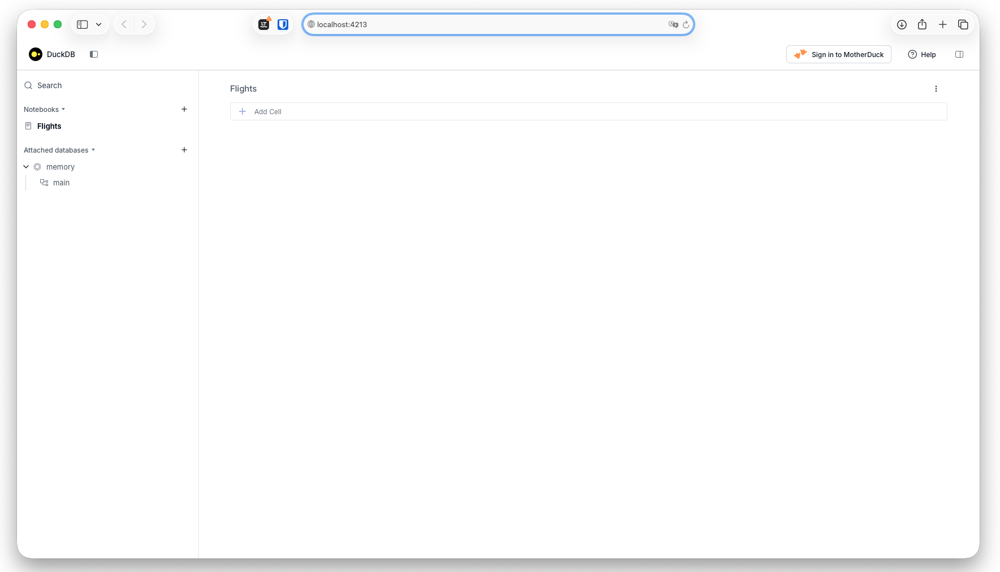
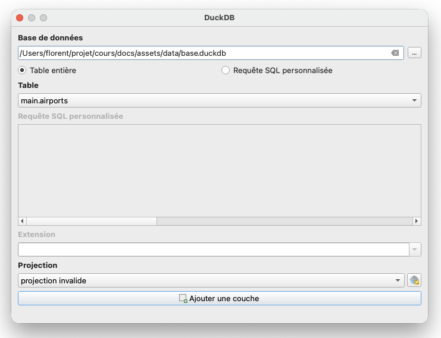
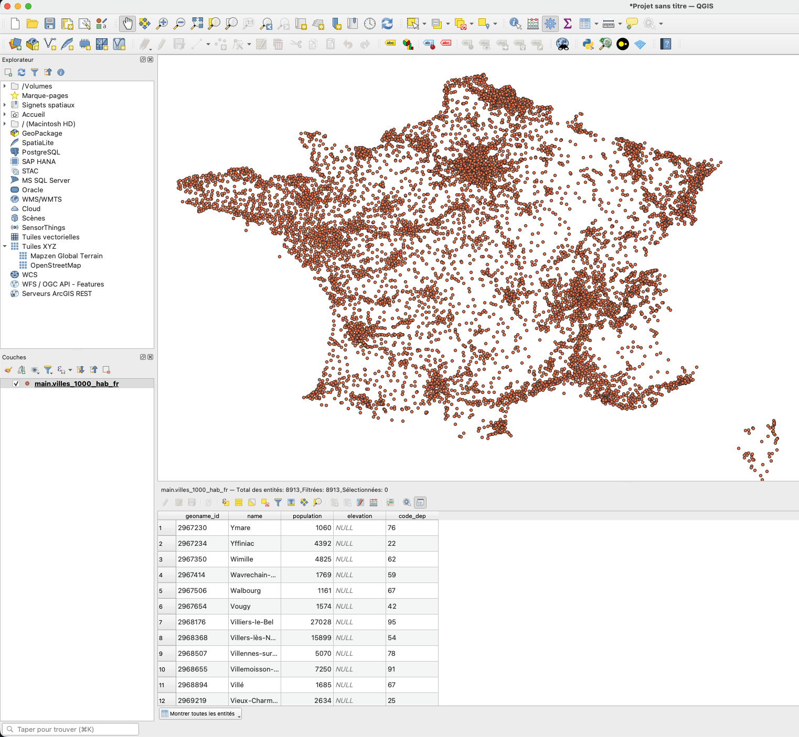
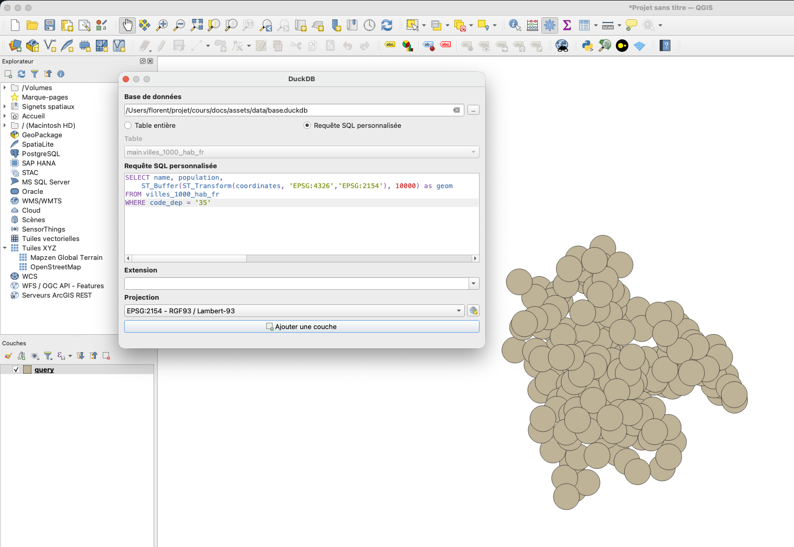

# Traitement de données géospatiales DuckDB

## La présentation

<iframe src="presentation.pdf" width="100%" height="600px"></iframe>

## Exercice 1 : Introduction avec la CLI DuckDB

### Télécharger l'exécutable DuckDB

Depuis le [site officiel](https://duckdb.org/install/?platform=windows&environment=cli)


### Lancer DuckDB depuis un terminal

Il faut, depuis un terminal, se placer dans le dossier où vous avez téléchargé l'exécutable, par exemple :

```bash
cd C:\Users\florent\
```

Puis lancer l'exécutable :

```bash
duckdb.exe
```

On arrive alors dans la console DuckDB (équivalent de psql) où l'on peut taper du SQL.

```sql
SELECT 1 as number, 'a' as letter ; 
```

!!! info
    Avant d'appuyer sur Entrée, il faut toujours terminer l'instruction SQL par un point-virgule `;`

### Installer l'extension spatial

```sql
INSTALL spatial; 
```

Puis charger l'extension :

```sql
LOAD spatial;
```

> La documentation de l'extension spatial se trouve sur cette [page](https://duckdb.org/docs/stable/core_extensions/spatial/overview), on y retrouve la liste des [fonctions](https://duckdb.org/docs/stable/core_extensions/spatial/functions) disponibles.

### Créer une base de données

!!! warning
    Actuellement nous sommes dans une base temporaire, tout ce que nous exécutons ne sera pas sauvegardé. Il faut donc créer une base de données pour conserver notre travail.

```sql
.open C:\Users\florent\chemin\vers\ma\base.duckdb
```

### Créer une table

Cette [page](https://duckdb.org/docs/stable/sql/statements/create_table) de la documentation montre des exemples.

On va créer une table nommée `ville` avec plusieurs champs : `id` sera notre clé primaire et s'auto-incrémentera, `nom` sera de type `VARCHAR` et `geom` sera un champ géométrique.

!!! warning
    Attention, les colonnes de géométrie n'ont pas de type.
    Une des particularités des colonnes de géométrie dans DuckDB spatial est l'absence de définition du type de géométrie (contrairement à PostGIS par exemple). Une même colonne de géométrie peut contenir aussi bien des points, des lignes, des polygones, etc. Il est donc possible de mélanger des points et des lignes dans une même table, mais même si c'est techniquement possible, je vous le déconseille.

```sql
CREATE SEQUENCE seq_ville START 1;
CREATE TABLE ville (
    id   INTEGER DEFAULT nextval('seq_ville') PRIMARY KEY,
    nom  VARCHAR,
    geom GEOMETRY
);
```

!!! info
    Pour rappel, une colonne de géométrie n'a pas de système de projection dans sa définition. En conséquence, il n'y a :
    - pas de définition de projection comme contrainte pour une colonne
    - pas d'attribution d'une projection lors d'un export

La commande `DESCRIBE` permet d'obtenir la description de la structure d'une table.

```sql
D describe ville ; 
┌─────────────┬─────────────┬─────────┬─────────┬─────────┬─────────┐
│ column_name │ column_type │  null   │   key   │ default │  extra  │
│   varchar   │   varchar   │ varchar │ varchar │ varchar │ varchar │
├─────────────┼─────────────┼─────────┼─────────┼─────────┼─────────┤
│ id          │ INTEGER     │ NO      │ PRI     │ NULL    │ NULL    │
│ nom         │ VARCHAR     │ YES     │ NULL    │ NULL    │ NULL    │
│ geom        │ GEOMETRY    │ YES     │ NULL    │ NULL    │ NULL    │
└─────────────┴─────────────┴─────────┴─────────┴─────────┴─────────┘
```

La commande `SHOW TABLES` permet de lister les tables.

```sql
D SHOW TABLES ; 
┌─────────┐
│  name   │
│ varchar │
├─────────┤
│ ville   │
└─────────┘
```

On va maintenant insérer des données dans notre table.

```sql
INSERT INTO ville (nom, geom) VALUES
    ('Rennes',    ST_GeomFromText('POINT(-1.6778 48.1173)')),
    ('Marseille', ST_GeomFromText('POINT(5.3698 43.2965)')),
    ('Laval',     ST_GeomFromText('POINT(-0.7667 48.0667)'));
```

Regardons le résultat.

```sql
D select * from ville ; 
┌───────┬───────────┬─────────────────────────┐
│  id   │    nom    │          geom           │
│ int32 │  varchar  │        geometry         │
├───────┼───────────┼─────────────────────────┤
│     1 │ Rennes    │ POINT (-1.6778 48.1173) │
│     2 │ Marseille │ POINT (5.3698 43.2965)  │
│     3 │ Laval     │ POINT (-0.7667 48.0667) │
└───────┴───────────┴─────────────────────────┘
```

### Importer un CSV et créer la géométrie

!!! info Lire un CSV
    La fonction `read_csv_auto` nous permet d'importer un CSV sans avoir à créer la table au préalable. Cette fonction détecte automatiquement la structure du CSV.

```sql
CREATE TABLE airports AS FROM read_csv_auto('https://davidmegginson.github.io/ourairports-data/airports.csv', HEADER=True, DELIM=',') ;
```

Il faut maintenant ajouter une colonne de géométrie à notre table.

```sql
ALTER TABLE airports ADD COLUMN the_geom GEOMETRY ;
```

Puis on met à jour cette colonne en créant un point à partir des colonnes `longitude_deg` et `latitude_deg` :

```sql
UPDATE airports SET the_geom = ST_POINT(longitude_deg, latitude_deg) ;
```

## Exercice 2 : Récupérer des données et effectuer nos premiers traitements géographiques

### Lancer l'interface web de DuckDB

!!! tip On va sortir du terminal
    Pour un peu plus de confort, on va réaliser cet exercice dans l'interface web fournie avec l'exécutable DuckDB, l'équivalent de `PgAdmin` pour DuckDB.

Il faut, depuis un terminal, se placer dans le dossier où vous avez téléchargé l'exécutable, par exemple :

```bash
cd C:\Users\florent\
```

Puis lancer l'exécutable avec l'option `-ui` :

```bash
duckdb.exe -ui
```

Une fenêtre va s'ouvrir dans votre navigateur web à l'adresse `http://localhost:4213/`



Une fois dans cette interface, on peut de nouveau se connecter à la base de données créée lors de l'exercice 1.

### Récupérer et explorer des données au format Parquet

Nous allons utiliser ce jeu de données : https://public.opendatasoft.com/explore/assets/geonames-all-cities-with-a-population-1000/

Depuis l'onglet `export`, on peut récupérer l'URL du fichier Parquet.

```url
https://public.opendatasoft.com/api/explore/v2.1/catalog/datasets/geonames-all-cities-with-a-population-1000/exports/parquet/?lang=fr&timezone=Europe%2FParis
```

!!! tip 
    Nous n'avons pas besoin de télécharger le fichier, nous allons directement fournir l'URL du fichier Parquet dans notre requête.

Pour lire un fichier distant, il est nécessaire de charger une autre extension :

```sql
load httpfs ;
```

On regarde à quoi ressemblent nos données :

```sql
SELECT * FROM read_parquet('https://public.opendatasoft.com/api/explore/v2.1/catalog/datasets/geonames-all-cities-with-a-population-1000/exports/parquet/?lang=fr&timezone=Europe%2FParis')
LIMIT 10; 
```

```sql
┌────────────┬──────────────────────┬──────────────────────┬──────────────────────┬───────────────┬──────────────┬───┬───────────┬───────┬─────────────────────┬───────────────────┬────────────────────┬──────────────────────┐
│ geoname_id │         name         │      ascii_name      │   alternate_names    │ feature_class │ feature_code │ … │ elevation │  dem  │      timezone       │ modification_date │      label_en      │     coordinates      │
│  varchar   │       varchar        │       varchar        │       varchar        │    varchar    │   varchar    │   │  varchar  │ int64 │       varchar       │       date        │      varchar       │         blob         │
├────────────┼──────────────────────┼──────────────────────┼──────────────────────┼───────────────┼──────────────┼───┼───────────┼───────┼─────────────────────┼───────────────────┼────────────────────┼──────────────────────┤
│ 696359     │ Peredmistna Slobidka │ Peredmistna Slobidka │ Predmostnaya,Predm…  │ P             │ PPL          │ … │ NULL      │   101 │ Europe/Kyiv         │ 2025-10-19        │ Ukraine            │ \x01\x01\x00\x00\x…  │
│ 12495567   │ Harbour Main-Chape…  │ Harbour Main-Chape…  │ NULL                 │ P             │ PPL          │ … │ NULL      │    54 │ America/St_Johns    │ 2024-05-21        │ Canada             │ \x01\x01\x00\x00\x…  │
│ 4003914    │ J. Jesús Díaz Tzirio │ J. Jesus Diaz Tzirio │ NULL                 │ P             │ PPL          │ … │ NULL      │  2257 │ America/Mexico_City │ 2013-08-01        │ Mexico             │ \x01\x01\x00\x00\x…  │
│ 906044     │ Monze                │ Monze                │ Monze                │ P             │ PPL          │ … │ NULL      │  1124 │ Africa/Lusaka       │ 2024-12-02        │ Zambia             │ \x01\x01\x00\x00\x…  │
│ 8859205    │ Loma de los Hoyos    │ Loma de los Hoyos    │ Loma de los Hoyos    │ P             │ PPL          │ … │ NULL      │   242 │ America/Mexico_City │ 2014-04-11        │ Mexico             │ \x01\x01\x00\x00\x…  │
│ 13513017   │ South Westminster    │ South Westminster    │ NULL                 │ P             │ PPLX         │ … │ NULL      │    22 │ America/Vancouver   │ 2025-09-08        │ Canada             │ \x01\x01\x00\x00\x…  │
│ 13527032   │ Anse Royale          │ Anse Royale          │ NULL                 │ P             │ PPLX         │ … │ NULL      │     4 │ Indian/Mahe         │ 2025-10-02        │ Seychelles         │ \x01\x01\x00\x00\x…  │
│ 2017537    │ Putyatin             │ Putyatin             │ Putjatin,Putyatin,…  │ P             │ PPL          │ … │ NULL      │    14 │ Asia/Vladivostok    │ 2024-04-20        │ Russian Federation │ \x01\x01\x00\x00\x…  │
│ 13191985   │ The Villas at Aeloa  │ The Villas at Aeloa  │ Aeloa,Kapolei Aelo…  │ P             │ PPLX         │ … │ NULL      │    27 │ Pacific/Honolulu    │ 2025-01-13        │ United States      │ \x01\x01\x00\x00\x…  │
│ 4295940    │ Ironville            │ Ironville            │ Ironville,ai en we…  │ P             │ PPL          │ … │ 219       │   221 │ America/New_York    │ 2012-07-14        │ United States      │ \x01\x01\x00\x00\x…  │
├────────────┴──────────────────────┴──────────────────────┴──────────────────────┴───────────────┴──────────────┴───┴───────────┴───────┴─────────────────────┴───────────────────┴────────────────────┴──────────────────────┤
│ 10 rows                                                                                                                                                                                                20 columns (12 shown) │
└──────────────────────────────────────────────────────────────────────────────────────────────────────────────────────────────────────────────────────────────────────────────────────────────────────────────────────────────┘
```

!!! warning
    Je n'ai pas fait le `load spatial`, donc la colonne de géométrie est mal interprétée : elle est de type blob. 

Après avoir refait le `load spatial`, j'obtiens une colonne de géométrie bien interprétée.

```sql
┌────────────┬──────────────────────┬──────────────────────┬──────────────────────┬───────────────┬──────────────┬───┬───────────┬───────┬─────────────────────┬───────────────────┬────────────────────┬──────────────────────┐
│ geoname_id │         name         │      ascii_name      │   alternate_names    │ feature_class │ feature_code │ … │ elevation │  dem  │      timezone       │ modification_date │      label_en      │     coordinates      │
│  varchar   │       varchar        │       varchar        │       varchar        │    varchar    │   varchar    │   │  varchar  │ int64 │       varchar       │       date        │      varchar       │       geometry       │
├────────────┼──────────────────────┼──────────────────────┼──────────────────────┼───────────────┼──────────────┼───┼───────────┼───────┼─────────────────────┼───────────────────┼────────────────────┼──────────────────────┤
│ 696359     │ Peredmistna Slobidka │ Peredmistna Slobidka │ Predmostnaya,Predm…  │ P             │ PPL          │ … │ NULL      │   101 │ Europe/Kyiv         │ 2025-10-19        │ Ukraine            │ POINT (30.58333 50…  │
│ 12495567   │ Harbour Main-Chape…  │ Harbour Main-Chape…  │ NULL                 │ P             │ PPL          │ … │ NULL      │    54 │ America/St_Johns    │ 2024-05-21        │ Canada             │ POINT (-53.1744 47…  │
│ 4003914    │ J. Jesús Díaz Tzirio │ J. Jesus Diaz Tzirio │ NULL                 │ P             │ PPL          │ … │ NULL      │  2257 │ America/Mexico_City │ 2013-08-01        │ Mexico             │ POINT (-102.39722 …  │
│ 906044     │ Monze                │ Monze                │ Monze                │ P             │ PPL          │ … │ NULL      │  1124 │ Africa/Lusaka       │ 2024-12-02        │ Zambia             │ POINT (27.48333 -1…  │
│ 8859205    │ Loma de los Hoyos    │ Loma de los Hoyos    │ Loma de los Hoyos    │ P             │ PPL          │ … │ NULL      │   242 │ America/Mexico_City │ 2014-04-11        │ Mexico             │ POINT (-102.44278 …  │
│ 13513017   │ South Westminster    │ South Westminster    │ NULL                 │ P             │ PPLX         │ … │ NULL      │    22 │ America/Vancouver   │ 2025-09-08        │ Canada             │ POINT (-122.87861 …  │
│ 13527032   │ Anse Royale          │ Anse Royale          │ NULL                 │ P             │ PPLX         │ … │ NULL      │     4 │ Indian/Mahe         │ 2025-10-02        │ Seychelles         │ POINT (55.50333 -4…  │
│ 2017537    │ Putyatin             │ Putyatin             │ Putjatin,Putyatin,…  │ P             │ PPL          │ … │ NULL      │    14 │ Asia/Vladivostok    │ 2024-04-20        │ Russian Federation │ POINT (132.41599 4…  │
│ 13191985   │ The Villas at Aeloa  │ The Villas at Aeloa  │ Aeloa,Kapolei Aelo…  │ P             │ PPLX         │ … │ NULL      │    27 │ Pacific/Honolulu    │ 2025-01-13        │ United States      │ POINT (-158.06726 …  │
│ 4295940    │ Ironville            │ Ironville            │ Ironville,ai en we…  │ P             │ PPL          │ … │ 219       │   221 │ America/New_York    │ 2012-07-14        │ United States      │ POINT (-82.69238 3…  │
├────────────┴──────────────────────┴──────────────────────┴──────────────────────┴───────────────┴──────────────┴───┴───────────┴───────┴─────────────────────┴───────────────────┴────────────────────┴──────────────────────┤
│ 10 rows                                                                                                                                                                                                20 columns (12 shown) │
└──────────────────────────────────────────────────────────────────────────────────────────────────────────────────────────────────────────────────────────────────────────────────────────────────────────────────────────────┘
```

On ne va pas garder toutes les colonnes. On va faire un `DESCRIBE` pour voir ce qui est disponible.

```sql
D DESCRIBE SELECT * 
FROM read_parquet('https://public.opendatasoft.com/api/explore/v2.1/catalog/datasets/geonames-all-cities-with-a-population-1000/exports/parquet/?lang=fr&timezone=Europe%2FParis')
LIMIT 1 ;
┌───────────────────┬─────────────┬─────────┬─────────┬─────────┬─────────┐
│    column_name    │ column_type │  null   │   key   │ default │  extra  │
│      varchar      │   varchar   │ varchar │ varchar │ varchar │ varchar │
├───────────────────┼─────────────┼─────────┼─────────┼─────────┼─────────┤
│ geoname_id        │ VARCHAR     │ YES     │ NULL    │ NULL    │ NULL    │
│ name              │ VARCHAR     │ YES     │ NULL    │ NULL    │ NULL    │
│ ascii_name        │ VARCHAR     │ YES     │ NULL    │ NULL    │ NULL    │
│ alternate_names   │ VARCHAR     │ YES     │ NULL    │ NULL    │ NULL    │
│ feature_class     │ VARCHAR     │ YES     │ NULL    │ NULL    │ NULL    │
│ feature_code      │ VARCHAR     │ YES     │ NULL    │ NULL    │ NULL    │
│ country_code      │ VARCHAR     │ YES     │ NULL    │ NULL    │ NULL    │
│ cou_name_en       │ VARCHAR     │ YES     │ NULL    │ NULL    │ NULL    │
│ country_code_2    │ VARCHAR     │ YES     │ NULL    │ NULL    │ NULL    │
│ admin1_code       │ VARCHAR     │ YES     │ NULL    │ NULL    │ NULL    │
│ admin2_code       │ VARCHAR     │ YES     │ NULL    │ NULL    │ NULL    │
│ admin3_code       │ BIGINT      │ YES     │ NULL    │ NULL    │ NULL    │
│ admin4_code       │ VARCHAR     │ YES     │ NULL    │ NULL    │ NULL    │
│ population        │ BIGINT      │ YES     │ NULL    │ NULL    │ NULL    │
│ elevation         │ VARCHAR     │ YES     │ NULL    │ NULL    │ NULL    │
│ dem               │ BIGINT      │ YES     │ NULL    │ NULL    │ NULL    │
│ timezone          │ VARCHAR     │ YES     │ NULL    │ NULL    │ NULL    │
│ modification_date │ DATE        │ YES     │ NULL    │ NULL    │ NULL    │
│ label_en          │ VARCHAR     │ YES     │ NULL    │ NULL    │ NULL    │
│ coordinates       │ GEOMETRY    │ YES     │ NULL    │ NULL    │ NULL    │
├───────────────────┴─────────────┴─────────┴─────────┴─────────┴─────────┤
│ 20 rows                                                       6 columns │
└─────────────────────────────────────────────────────────────────────────┘
```

!!! tip
    En utilisant `DESCRIBE` de cette manière, on est tout de même obligé de récupérer des données pour obtenir la description de la table. Il existe une méthode plus efficace : la fonction `parquet_schema`. Cette fonction lit uniquement le **footer du fichier Parquet** (quelques Ko), qui contient le schéma, sans charger les données. Cela fonctionne parfaitement avec des fichiers locaux ou des URLs pointant vers des fichiers Parquet statiques.

```sql
D SELECT * FROM parquet_schema('https://public.opendatasoft.com/api/explore/v2.1/catalog/datasets/geonames-all-cities-with-a-population-1000/exports/parquet/?lang=fr&timezone=Europe%2FParis');
┌───────────────────────────────────────────────────────────────────────────┬───────────────────┬────────────┬─────────────┬─────────────────┬──────────────┬────────────────┬───────┬───────────┬──────────┬──────────────┬─────────────┐
│                                 file_name                                 │       name        │    type    │ type_length │ repetition_type │ num_children │ converted_type │ scale │ precision │ field_id │ logical_type │ duckdb_type │
│                                  varchar                                  │      varchar      │  varchar   │   varchar   │     varchar     │    int64     │    varchar     │ int64 │   int64   │  int64   │   varchar    │   varchar   │
├───────────────────────────────────────────────────────────────────────────┼───────────────────┼────────────┼─────────────┼─────────────────┼──────────────┼────────────────┼───────┼───────────┼──────────┼──────────────┼─────────────┤
│ https://public.opendatasoft.com/api/explore/v2.1/catalog/datasets/geona…  │ schema            │ NULL       │ NULL        │ REQUIRED        │           20 │ NULL           │  NULL │      NULL │     NULL │ NULL         │ NULL        │
│ https://public.opendatasoft.com/api/explore/v2.1/catalog/datasets/geona…  │ geoname_id        │ BYTE_ARRAY │ NULL        │ OPTIONAL        │         NULL │ UTF8           │  NULL │      NULL │     NULL │ StringType() │ VARCHAR     │
│ https://public.opendatasoft.com/api/explore/v2.1/catalog/datasets/geona…  │ name              │ BYTE_ARRAY │ NULL        │ OPTIONAL        │         NULL │ UTF8           │  NULL │      NULL │     NULL │ StringType() │ VARCHAR     │
│ https://public.opendatasoft.com/api/explore/v2.1/catalog/datasets/geona…  │ ascii_name        │ BYTE_ARRAY │ NULL        │ OPTIONAL        │         NULL │ UTF8           │  NULL │      NULL │     NULL │ StringType() │ VARCHAR     │
│ https://public.opendatasoft.com/api/explore/v2.1/catalog/datasets/geona…  │ alternate_names   │ BYTE_ARRAY │ NULL        │ OPTIONAL        │         NULL │ UTF8           │  NULL │      NULL │     NULL │ StringType() │ VARCHAR     │
│ https://public.opendatasoft.com/api/explore/v2.1/catalog/datasets/geona…  │ feature_class     │ BYTE_ARRAY │ NULL        │ OPTIONAL        │         NULL │ UTF8           │  NULL │      NULL │     NULL │ StringType() │ VARCHAR     │
│ https://public.opendatasoft.com/api/explore/v2.1/catalog/datasets/geona…  │ feature_code      │ BYTE_ARRAY │ NULL        │ OPTIONAL        │         NULL │ UTF8           │  NULL │      NULL │     NULL │ StringType() │ VARCHAR     │
│ https://public.opendatasoft.com/api/explore/v2.1/catalog/datasets/geona…  │ country_code      │ BYTE_ARRAY │ NULL        │ OPTIONAL        │         NULL │ UTF8           │  NULL │      NULL │     NULL │ StringType() │ VARCHAR     │
│ https://public.opendatasoft.com/api/explore/v2.1/catalog/datasets/geona…  │ cou_name_en       │ BYTE_ARRAY │ NULL        │ OPTIONAL        │         NULL │ UTF8           │  NULL │      NULL │     NULL │ StringType() │ VARCHAR     │
│ https://public.opendatasoft.com/api/explore/v2.1/catalog/datasets/geona…  │ country_code_2    │ BYTE_ARRAY │ NULL        │ OPTIONAL        │         NULL │ UTF8           │  NULL │      NULL │     NULL │ StringType() │ VARCHAR     │
│ https://public.opendatasoft.com/api/explore/v2.1/catalog/datasets/geona…  │ admin1_code       │ BYTE_ARRAY │ NULL        │ OPTIONAL        │         NULL │ UTF8           │  NULL │      NULL │     NULL │ StringType() │ VARCHAR     │
│ https://public.opendatasoft.com/api/explore/v2.1/catalog/datasets/geona…  │ admin2_code       │ BYTE_ARRAY │ NULL        │ OPTIONAL        │         NULL │ UTF8           │  NULL │      NULL │     NULL │ StringType() │ VARCHAR     │
│ https://public.opendatasoft.com/api/explore/v2.1/catalog/datasets/geona…  │ admin3_code       │ INT64      │ NULL        │ OPTIONAL        │         NULL │ NULL           │  NULL │      NULL │     NULL │ NULL         │ BIGINT      │
│ https://public.opendatasoft.com/api/explore/v2.1/catalog/datasets/geona…  │ admin4_code       │ BYTE_ARRAY │ NULL        │ OPTIONAL        │         NULL │ UTF8           │  NULL │      NULL │     NULL │ StringType() │ VARCHAR     │
│ https://public.opendatasoft.com/api/explore/v2.1/catalog/datasets/geona…  │ population        │ INT64      │ NULL        │ OPTIONAL        │         NULL │ NULL           │  NULL │      NULL │     NULL │ NULL         │ BIGINT      │
│ https://public.opendatasoft.com/api/explore/v2.1/catalog/datasets/geona…  │ elevation         │ BYTE_ARRAY │ NULL        │ OPTIONAL        │         NULL │ UTF8           │  NULL │      NULL │     NULL │ StringType() │ VARCHAR     │
│ https://public.opendatasoft.com/api/explore/v2.1/catalog/datasets/geona…  │ dem               │ INT64      │ NULL        │ OPTIONAL        │         NULL │ NULL           │  NULL │      NULL │     NULL │ NULL         │ BIGINT      │
│ https://public.opendatasoft.com/api/explore/v2.1/catalog/datasets/geona…  │ timezone          │ BYTE_ARRAY │ NULL        │ OPTIONAL        │         NULL │ UTF8           │  NULL │      NULL │     NULL │ StringType() │ VARCHAR     │
│ https://public.opendatasoft.com/api/explore/v2.1/catalog/datasets/geona…  │ modification_date │ INT32      │ NULL        │ OPTIONAL        │         NULL │ DATE           │  NULL │      NULL │     NULL │ DateType()   │ DATE        │
│ https://public.opendatasoft.com/api/explore/v2.1/catalog/datasets/geona…  │ label_en          │ BYTE_ARRAY │ NULL        │ OPTIONAL        │         NULL │ UTF8           │  NULL │      NULL │     NULL │ StringType() │ VARCHAR     │
│ https://public.opendatasoft.com/api/explore/v2.1/catalog/datasets/geona…  │ coordinates       │ BYTE_ARRAY │ NULL        │ OPTIONAL        │         NULL │ NULL           │  NULL │      NULL │     NULL │ NULL         │ BLOB        │
├───────────────────────────────────────────────────────────────────────────┴───────────────────┴────────────┴─────────────┴─────────────────┴──────────────┴────────────────┴───────┴───────────┴──────────┴──────────────┴─────────────┤
│ 21 rows                                                                                                                                                                                                                     12 columns │
└────────────────────────────────────────────────────────────────────────────────────────────────────────────────────────────────────────────────────────────────────────────────────────────────────────────────────────────────────────┘
```

### Créer une table à partir d'un fichier Parquet

!!! warning 
    Attention aux fichiers Parquet distants.
    Tous les serveurs ne sont pas compatibles avec les requêtes HTTP Range. Dans ce cas, DuckDB ne peut pas tirer parti du stockage en colonnes pour ne télécharger que ce dont il a besoin — il est forcé de tout récupérer d'un coup, ce qui peut provoquer des erreurs.

    La solution est d'utiliser `SET force_download=true;` pour indiquer à DuckDB de télécharger le fichier en entier avant de l'interroger.

    **Si le fichier Parquet était en local**, ce problème n'existerait pas : DuckDB lirait directement les colonnes nécessaires sur votre disque, sans contrainte réseau, et profiterait pleinement de tous les avantages du format (column pruning, predicate pushdown...).

    Retenez donc que les gains de performance de Parquet sont maximaux quand les fichiers sont **en local ou sur un stockage cloud bien configuré** (S3, GCS, Azure Blob).

On va donc exécuter `SET force_download=true;` (sauf si vous avez téléchargé le fichier Parquet en local).

On va créer une table dans notre base en ne gardant que certaines colonnes et les villes françaises.

```sql
CREATE TABLE villes_1000_hab_fr AS SELECT geoname_id, name, population, elevation, coordinates 
FROM read_parquet('https://public.opendatasoft.com/api/explore/v2.1/catalog/datasets/geonames-all-cities-with-a-population-1000/exports/parquet/?lang=fr&timezone=Europe%2FParis')
WHERE country_code = 'FR' ;
```

On vérifie qu'on a bien récupéré des données :

```sql
D SELECT * FROM villes_1000_hab_fr LIMIT 5 ;
┌────────────┬────────────────────────┬────────────┬───────────┬───────────────────────────┐
│ geoname_id │          name          │ population │ elevation │        coordinates        │
│  varchar   │        varchar         │   int64    │  varchar  │         geometry          │
├────────────┼────────────────────────┼────────────┼───────────┼───────────────────────────┤
│ 2967230    │ Ymare                  │       1060 │ NULL      │ POINT (1.17938 49.3506)   │
│ 2967234    │ Yffiniac               │       4392 │ NULL      │ POINT (-2.67757 48.48479) │
│ 2967350    │ Wimille                │       4825 │ NULL      │ POINT (1.63137 50.76418)  │
│ 2967414    │ Wavrechain-sous-Denain │       1769 │ NULL      │ POINT (3.41252 50.33224)  │
│ 2967506    │ Walbourg               │       1161 │ NULL      │ POINT (7.78828 48.88628)  │
└────────────┴────────────────────────┴────────────┴───────────┴───────────────────────────┘
```

### Utiliser les fonctions spatiales de DuckDB

L'objectif est d'ajouter une colonne départements à notre table des villes françaises de plus de 1 000 habitants, via une jointure spatiale.

Vous trouverez [ici](../assets/data/departements.geojson) une couche des départements.

On va maintenant intégrer ce GeoJSON dans notre base de données. Pour cela, nous allons utiliser la fonction `st_read`, documentée [ici](https://duckdb.org/docs/stable/core_extensions/spatial/functions#st_read). Elle nous permet de lire un fichier spatial dans une clause `FROM` ; divers formats sont supportés grâce à l'utilisation de GDAL.

```sql
CREATE TABLE departement AS
SELECT * FROM st_read('/home/florent/perso/cours/docs/assets/data/departements.geojson');
```

Vérifions que la table est bien intégrée.

```sql
D SELECT * FROM departement LIMIT 2 ;
┌────────────┬────────────┬──────────────────────┬───────────────────────────────────────────────────────────────────────────────────────────────────────────────────────────────────────────────────────────────────────────────────────┐
│ DDEP_C_COD │ DDEP_L_LIB │      DREG_L_LIB      │                                                                                         geom                                                                                          │
│  varchar   │  varchar   │       varchar        │                                                                                       geometry                                                                                        │
├────────────┼────────────┼──────────────────────┼───────────────────────────────────────────────────────────────────────────────────────────────────────────────────────────────────────────────────────────────────────────────────────┤
│ 01         │ Ain        │ Auvergne-Rhône-Alpes │ POLYGON ((6.1684513 46.3674591, 6.1666758 46.3707436, 6.1609838 46.3765521, 6.1471235 46.3798282, 6.1204011 46.3959546, 6.1065032 46.3998394, 6.0975256 46.4082841, 6.0640085 46.41…  │
│ 02         │ Aisne      │ Hauts-de-France      │ POLYGON ((4.2557339 49.9039769, 4.2369361 49.9037822, 4.2336436 49.9091161, 4.2221419 49.9104265, 4.2177737 49.9162558, 4.2202062 49.9335887, 4.2321319 49.9559556, 4.2330683 49.95…  │
└────────────┴────────────┴──────────────────────┴───────────────────────────────────────────────────────────────────────────────────────────────────────────────────────────────────────────────────────────────────────────────────────┘
```

Ajoutons maintenant une colonne `code_dep` à notre table `villes_1000_hab_fr`.

Pour cela, deux solutions s'offrent à nous :

- Créer d'abord la colonne, puis la remplir via une instruction `UPDATE`
- Créer une nouvelle table et supprimer l'ancienne

#### Option 1 : créer la colonne et la mettre à jour ensuite

```sql
ALTER TABLE villes_1000_hab_fr ADD COLUMN code_dep VARCHAR;

UPDATE villes_1000_hab_fr
SET code_dep = d.DDEP_C_COD
FROM departement d
WHERE ST_Within(villes_1000_hab_fr.coordinates, d.geom);
```

#### Option 2 : nouvelle table

```sql
CREATE TABLE villes_1000_hab_fr_new AS
SELECT v.*, d.DDEP_C_COD AS code_dep
FROM villes_1000_hab_fr v
JOIN departement d
  ON ST_Within(v.coordinates, d.geom);

DROP TABLE villes_1000_hab_fr;

ALTER TABLE villes_1000_hab_fr_new RENAME TO villes_1000_hab_fr;
```

## Exercice 3 : Utiliser le plugin QGIS et visualiser nos données

### Installer le plugin QGIS

Depuis le gestionnaire des extensions QGIS.


!!! warning
    Si vous êtes sur **Windows**, le plugin intègre la dépendance Python `duckdb`, il n'y a donc rien à faire de plus. En revanche, si vous êtes sur macOS ou Linux, il faut consulter la [documentation](https://oslandia.gitlab.io/qgis/qduckdb/usage/installation.html) du plugin.

### Visualiser dans QGIS les couches réalisées dans les exercices 1 et 2

Dans votre barre des extensions de QGIS, vous trouverez une icône DuckDB qui lance l'interface du plugin. Chargez votre base de données.

!!! warning
    DuckDB ne connaît pas (encore) la projection des données, il est impératif de la préciser.



!!! info
    Nous avons créé nos tables sans préciser de schéma, elles se trouvent donc dans le schéma `main` (équivalent du schéma `public` de PostGIS).

Exemple de visualisation, notre couche `villes_1000_hab_fr` :



### Exécuter des sélections SQL depuis le plugin

Depuis le plugin, il est possible de charger des couches via des requêtes SQL.

#### Chargement des villes du département 35

```sql
SELECT * 
FROM villes_1000_hab_fr
WHERE code_dep = '35'
```


#### Chargement d'une couche de buffer autour des points

!!! warning
    Notre couche est en WGS84 (`EPSG:4326`). Si on effectue un buffer sans convertir vers une projection métrique, la distance sera exprimée en degrés. Il faut donc forcer une transformation en Lambert-93 à l'aide de la fonction `ST_Transform` et indiquer à QGIS que la couche est en `EPSG:2154`.

```sql
SELECT name, population, 
    ST_Buffer(ST_Transform(coordinates, 'EPSG:4326','EPSG:2154'), 10000) as geom
FROM villes_1000_hab_fr
WHERE code_dep = '35';
```



## Exercice 4 : Traiter des données parquet d'Overture Maps avec DuckDB

*Cet exercice est issus de mon [article](https://geotribu.fr/articles/2023/2023-12-19_duckdb-donnees-spatiales/) sur DuckDB publié sur Géotribu*

!!! abstract
    Les données Overture Maps sont une base de données cartographique ouverte qui décrit des éléments du monde réel comme les routes, les bâtiments, les adresses ou les lieux.
    Le projet est géré par la Overture Maps Foundation, une organisation créée par de grandes entreprises technologiques comme Amazon, Microsoft, Meta et TomTom,

Les données d’Overture Maps sont fournies sous forme de fichier Parquet ([décrites ici](https://docs.overturemaps.org/overview/feature-model/)), nous allons donc importer ces données dans une base pour les consulter.

### Importer les données dans la base

Dans cet exemple, on récupère 100 bâtiments aléatoirement.


```sql
CREATE TABLE buildings AS (
SELECT
    type, version, height, level, class, JSON(names) as names, JSON(sources) as sources, geometry
FROM
    read_parquet('s3://overturemaps-us-west-2/release/2026-01-21.0/theme=buildings/type=building/*.parquet', hive_partitioning=1)
LIMIT 100);
```

Dans cet autre exemple, on récupère les bâtiments d’une partie de la ville de Laval en indiquant les coordonnées d’un rectangle.

```sql
CREATE TABLE laval_buildings AS ( 
SELECT
    type, version, height, level, JSON(names) as names, JSON(sources) as sources, geometry
FROM
    read_parquet('s3://overturemaps-us-west-2/release/2026-01-21.0/theme=buildings/type=building/*.parquet', hive_partitioning=1)
WHERE 
    bbox.xmin > -0.7948129589175504
    AND bbox.xmax < -0.7472280816538276
    AND bbox.ymin > 48.069335046027035
    AND bbox.ymax < 48.073450034830316);
```

### Convertir les données en un GeoJSON en utilisant DuckDB

Un des atouts de DuckDB est qu'en plus d’intégrer des données pour les traiter en base, il peut servir d’outil de conversion pour des données Parquet. Exemple : si on me donne des données en Parquet et je souhaite des GeoJSON, DuckDB peut les convertir sans créer de table ni de base !

```sql
COPY (
    SELECT
        type,version, height, level, JSON(names) as names, JSON(sources) as sources, geometry
    FROM
        read_parquet('s3://overturemaps-us-west-2/release/2026-01-21.0/theme=buildings/type=building/*.parquet', hive_partitioning=1)
    WHERE 
        bbox.xmin > -0.7948129589175504
        AND bbox.xmax < -0.7472280816538276
        AND bbox.ymin > 48.069335046027035
        AND bbox.ymax < 48.073450034830316)
TO 'laval_buildings.geojson'
WITH (FORMAT GDAL, DRIVER 'GeoJSON', SRS 'EPSG:4326');
```

:bulb: Il est également possible d'exporter en Shapefile, pour cela, il faut remplacer les deux dernières lignes par celles-ci :

```sql
TO 'laval_buildings.shp'
WITH (FORMAT GDAL, DRIVER 'ESRI Shapefile', SRS 'EPSG:4326');
```

## Exercice 5 : DuckDB avec l'Open Data de Rennes Métropole

Le [portail Open Data de Rennes Métropole](https://data.rennesmetropole.fr/pages/home/) fournit les données au format Parquet.

- Intégrez dans une base DuckDB deux couches de votre choix
- Utilisez les fonctions spatiales de DuckDB pour croiser spatialement ces données
- Chargez le résultat dans QGIS à l'aide du plugin QDuckDB

